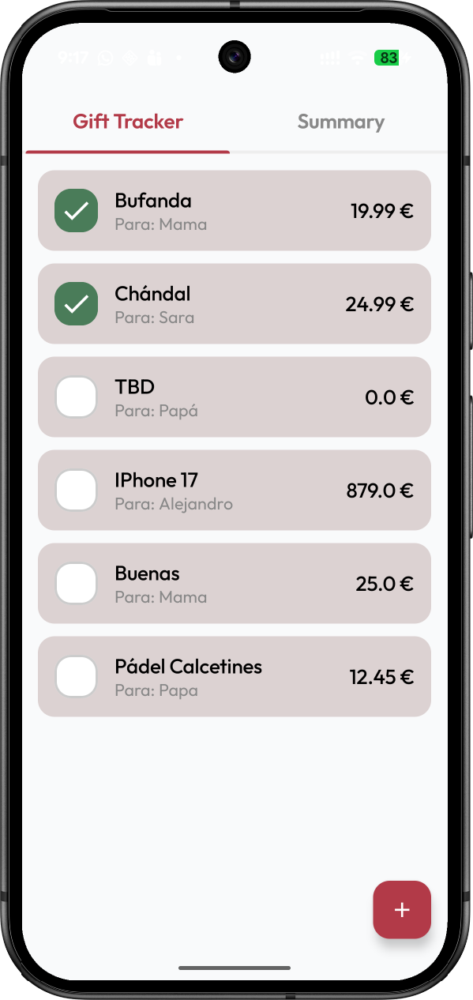
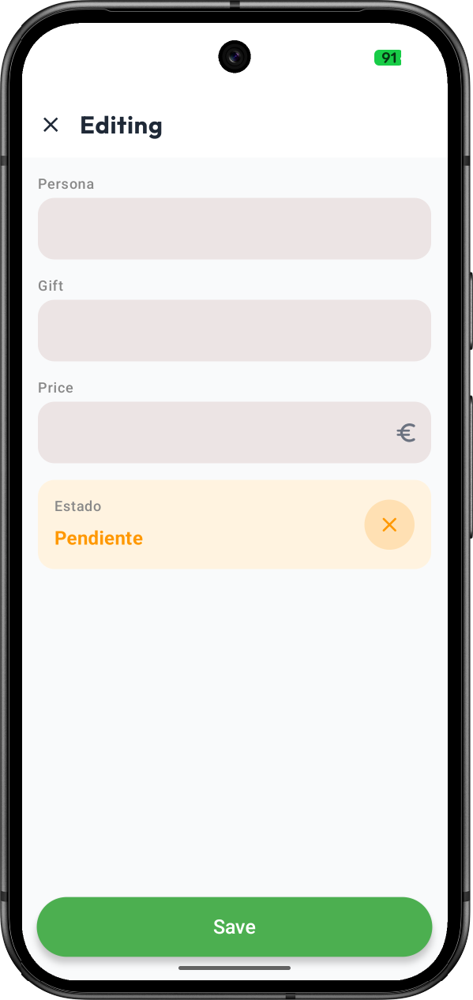
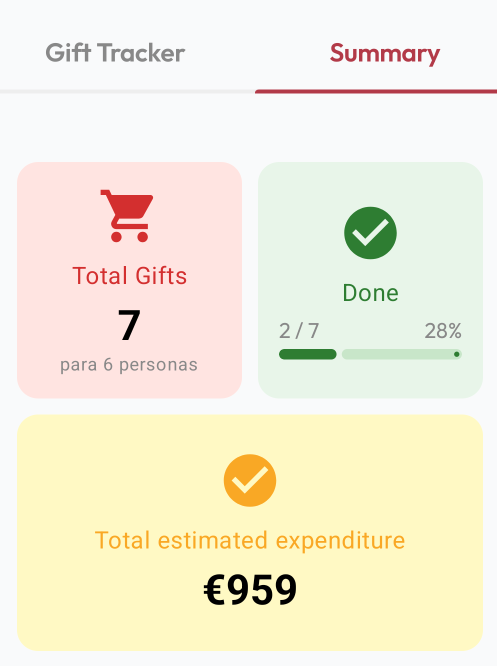

### Overview

This repository contains a collaborative Christmas-themed **Android Code Kata** designed to practice
modern UI development with **Jetpack Compose**.  
It’s meant to be done with teammates, focusing on building **adaptive layouts** for mobile and
tablet, adding small **animations**, and exploring the new **Navigation 3** APIs — especially the
use of **pane-based navigation** for multi-window experiences.

Perfect for a short team session to experiment, learn, and have fun while creating a simple but
responsive **Gift Tracker** app.

# 🎁 Gift Tracker Code Kata

> **Gift-Tracker-Code-Kata** is a **code kata** designed to practice **Jetpack Compose** and **UI
animations** in Android by building a simple Christmas Gift Tracker app.

This repository is meant as a **learning and practice exercise**, either solo or with teammates. The
focus is on:

- Jetpack Compose layouts
- Animations and transitions
- Adaptive UI (different screen sizes)
- Clean UI structure and navigation

---

## 📸 Screenshots

<!-- Add screenshots here showing how the UI should look -->
<!-- EXAMPLE: -->
<!--  -->
<!--  -->

---

## 🧠 What is a Code Kata?

A **code kata** is a small programming exercise intended to be repeated and refined to improve
skills, design decisions, and confidence.

In this kata, the main goal is to **practice Jetpack Compose**, **animations**, and **modern Android
UI patterns**.

---

## 🚀 Project Goals

By completing this kata, you will build an app that allows users to:

1. Display a list of gifts
2. Add new gifts
3. View gift details
4. Edit existing gifts
5. Delete gifts
6. Add UI animations and transitions
7. Create adaptive layouts (phone / tablet)
8. Handle basic state and navigation
9. Improve UI/UX with feedback and empty states

---

## 🧩 Tasks to Complete

<!-- TODO : Modify the tasks -->
Below is the recommended list of tasks to **progressively complete the app**.

### 1. 📋 Gift List (`GiftListScreen`)

- Display a list of gifts
- Each item shows:
    - Gift name
    - Person
    - Status
    - Price
- Add list animations (enter / exit)
  

---

### 2. ➕ Add Gift Screen (`GiftDetailScreen`)

- Create FloatingActionButton to open Add Gift screen
- Animate the FAB to appear only in the Gift List screen
- Navigate to Add Gift Screen
    - If we click on the FAB, we pass null (new gift)
    - If we click on an existing gift, we pass the gift ID
- Form to create a new gift:
    - Person Name
    - Gift Name
    - Price. TrailingIcon with currency symbol.
    - Status, isPurchased?
- Save/Edit button
- The navigate back button in the top app bar change with a close icon when in Add/Edit mode

---

### 3. 🔍 Summary Screen (`SummaryScreen`)

Display main info about the total of the gifts
- Create a item which contains a icon, text and @Composable content. We should be able to reuse it and pass the surface and icon color.
- Create a grid layout with an odd number of items.:
    - When we have only one item in a row, it should take the full width.
    - The maximum number of columns is 2 when compact and 3 when expanded.
  
  
---

### 4. ✏️ Circular chart

- Reuse the Add Gift form
- Pre-fill existing data
- Save changes

📌 *Screenshot placeholder:*  
`<!--  -->`

---

### 5. Next Steps 

- Delete from detail screen or swipe action
- Show confirmation dialog

📌 *Screenshot placeholder:*  
`<!--  -->`

---

### 6. 💫 UI Animations

Suggested ideas:

- Animated list item insertion/removal
- Screen transitions
- Button and form focus animations

📌 *Screenshot placeholder:*  
`<!--  -->`

---

### 7. 📱 Adaptive Layout

- Support different screen sizes
- Use responsive layouts (Row / Column)
- Optional pane-based layout for tablets

📌 *Screenshot placeholder:*  
`<!--  -->`

---

