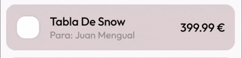
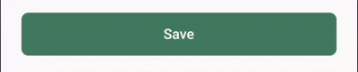
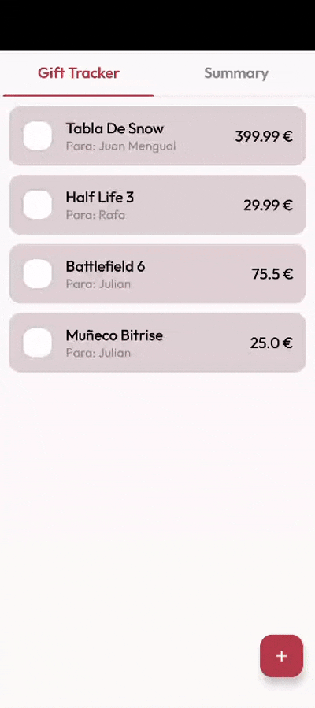
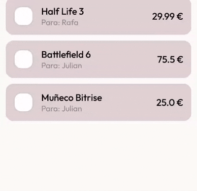

# 🎁 Gift Tracker Code Kata

> **Gift-Tracker-Code-Kata** is a **code kata** designed to practice **Jetpack Compose** and **UI
animations** in Android by building a simple Christmas Gift Tracker app.

---

## 📸 Screenshots

  
  
  

---

## 🎯 Overview

This repository contains a collaborative Christmas-themed **Android Code Kata** designed to practice
modern UI development with **Jetpack Compose**.

It's meant to be done with teammates, focusing on building **adaptive layouts** for mobile and
tablet, adding small **animations**, and exploring the new **Navigation 3** APIs — especially the
use of **pane-based navigation** for multi-window experiences.

Perfect for a short team session to experiment, learn, and have fun while creating a simple but
responsive **Gift Tracker** app.

---

## 🧠 What is a Code Kata?

A **code kata** is a small programming exercise intended to be repeated and refined to improve
skills, design decisions, and confidence.

In this kata, the main goal is to **practice Jetpack Compose**, **animations**, and **modern Android
UI patterns**.

---

## 🚀 Project Goals

By completing this kata, you will build an app that allows users to:

1. ✅ Display a list of gifts
2. ➕ Add new gifts
3. 👁️ View gift details
4. ✏️ Edit existing gifts
5. 🗑️ Delete gifts
6. 💫 Add UI animations and transitions
7. 📱 Create adaptive layouts (phone / tablet)
8. 🔄 Handle basic state and navigation
9. 🎨 Improve UI/UX with feedback and empty states
10. 🧭 Explore the new Navigation 3 API
11. 🖼️ Play with edge-to-edge and theming

---

## 🧩 Tasks to Complete

Below is the recommended list of tasks to **progressively complete the app**.

## Create Composables

### 1. 📋 Gift List (`GiftListScreen`)

#### Create Gift Item Composable

Display a gift with the following information:

- Person Name
- Gift Name
- Price
- Status (isPurchased?)

  

#### Create Floating Action Button

  

---

### 2. ➕ Add Gift Screen (`GiftDetailScreen`)

Create a Gift detail screen to add or edit a gift.

#### Navigation

- If we click on the FAB → pass `null` (new gift)
- If we click on an existing gift → pass the gift ID

#### Reusable TextField Component

Create a reusable TextField composable with:

- Label
- Initial Value
- `onValueChange` callback
- Category
- Optional TrailingIcon
- Keyboard Options & Actions

  

#### Gift Status Field

Add field below the text fields to show if the gift is purchased or not.

  

#### TopAppBar

Create the form with a TopAppBar and a back button or close button depending if the user is editing.

  

#### Save/Edit Button

Add a save/edit button to change mode.

  
  

---

### 3. 🔍 Summary Screen (`SummaryScreen`)

Display main info about the total of the gifts.

#### Reusable Summary Item

Create an item which contains an icon, text and `@Composable` content. We should be able to reuse it
and pass the surface and icon color.

#### Grid Layout

Create a grid layout with an odd number of items:

- When we have only one item in a row, it should take the full width
- Maximum number of columns: **2** when compact, **3** when expanded

**Recommended Items:**

- Total Gifts
- Total Expense
- Most expensive gift
- Least expensive gift

  

---

#### 3.1 📊 Circular Chart

Create a circular chart to show the total expense and the expense per person.

> **TODO:** Add documentation about how to create a circular chart in Compose.

  

---

#### 3.2 ⏭️ Next Steps Section

Create a NextSteps section which shows the remaining gifts to buy.

- Be able to mark the gift as purchased from this section
- Show confirmation snackbar when marking as purchased (TODO)

  

---

## 💫 UI Animations

For this part of the kata we will focus on adding animations to improve the user experience.

All the animations are done with the Compose animation APIs. For more information and help, check
the link:

- 📚 [Compose Animation APIs](https://developer.android.com/develop/ui/compose/animation/choose-api)

---

### 1. 🎞️ Gift Item Animations

Add animations to the gift item in the list when the user checks the gift as purchased. The item
should be animated as if it is being **wrapped as a gift**.

**Example:**

  

---

### 2. 🎈 FAB Animation

The FAB should only appear when the user is in the Gift List screen. Animate the visibility of the
FAB when navigating to the SummaryScreen.

  

---

### 3. 💾 Save/Edit Button Animation

When the user is adding or editing a gift, animate the Save/Edit button to give feedback:

- **Editing → Save:** Button transitions with size and color change
- **Save → Editing:** Same transition \+ show a loading indicator

  

---

### 4. 🔄 Screen Transition Animations

Add transition animations when navigating between screens using Navigation 3.

  

---

### 5. 🖼️ List/Details View Animation

When the user selects a gift from the list to view its details:

- Animate the transition between the list item and the detail view
- On wide screens, show both views side by side in two different panes

---

### 6. 📜 List Appearance Animation

Animate the items when the gift list appears on the screen to create a more engaging experience.

---

### 7. 🗑️ Swipe to Delete with Animation

When the user swipes a gift item to the right, animate the item showing it's going to be deleted.

📚 [Drag, swipe, and fling](https://developer.android.com/develop/ui/compose/touch-input/pointer-input/drag-swipe-fling#swiping)

  

---

### 🏆 EXTRA POINTS: Advanced Animations 🤓

It is said that the most brave developers do not stop here. They go further for more animations!

If you are a brave developer, try adding a new animation for the chart in the summary screen:

- Animate the chart when the data changes
- Animate when the user navigates to the summary screen

---

## 🏷️ Create Categories (TODO)

---

## 📝 License

This project is for educational purposes.

---

## 🤝 Contributing

Feel free to fork this repository and practice on your own, or submit PRs with improvements!

---

**Happy Coding! 🎄✨**
