### Overview

This repository contains a collaborative Christmas-themed **Android Code Kata** designed to practice
modern UI development with **Jetpack Compose**.  
It’s meant to be done with teammates, focusing on building **adaptive layouts** for mobile and
tablet, adding small **animations**, and exploring the new **Navigation 3** APIs — especially the
use of **pane-based navigation** for multi-window experiences.

Perfect for a short team session to experiment, learn, and have fun while creating a simple but
responsive **Gift Tracker** app.

# 🎁 Gift Tracker Code Kata

> **Gift-Tracker-Code-Kata** is a **code kata** designed to practice **Jetpack Compose** and **UI
animations** in Android by building a simple Christmas Gift Tracker app.

This repository is meant as a **learning and practice exercise**, either solo or with teammates. The
focus is on:

- Jetpack Compose layouts
- Animations and transitions
- Adaptive UI (different screen sizes)
- Clean UI structure and navigation

---

## 📸 Screenshots

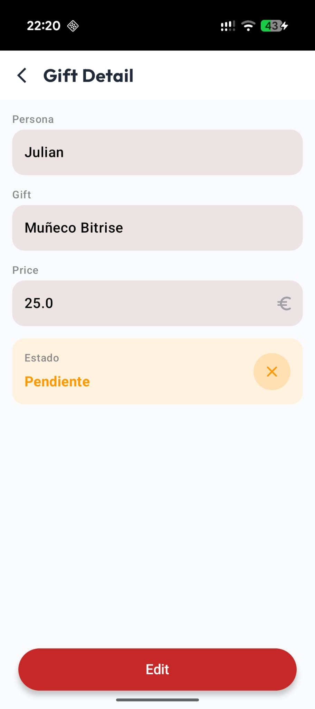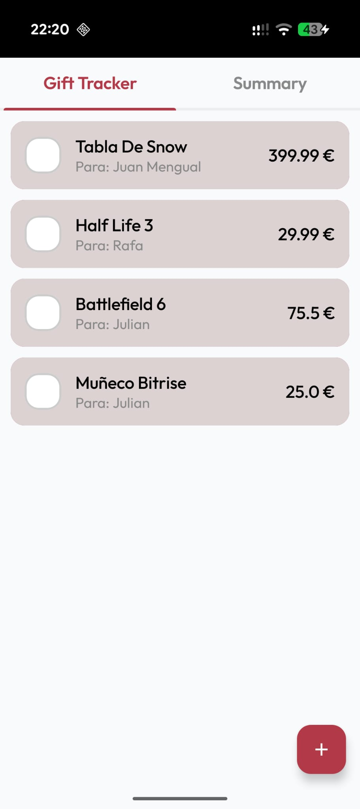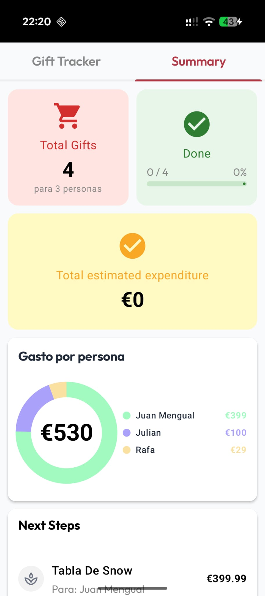

---

## 🧠 What is a Code Kata?

A **code kata** is a small programming exercise intended to be repeated and refined to improve
skills, design decisions, and confidence.

In this kata, the main goal is to **practice Jetpack Compose**, **animations**, and **modern Android
UI patterns**.

---

## 🚀 Project Goals

By completing this kata, you will build an app that allows users to:

1. Display a list of gifts
2. Add new gifts
3. View gift details
4. Edit existing gifts
5. Delete gifts
6. Add UI animations and transitions
7. Create adaptive layouts (phone / tablet)
8. Handle basic state and navigation
9. Improve UI/UX with feedback and empty states
10. A little of the new nav 3 API
11. Play with edge-to-edge and theming

---

# 🧩 Tasks to Complete

Below is the recommended list of tasks to **progressively complete the app**.

## Create composables

### 1. 📋 Gift List (`GiftListScreen`)

- Create a composable to display a gift.
    - Person Name
    - Gift Name
    - Price
    - Status, isPurchased?

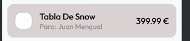

- Create the Floating Action Button to add a new gift
  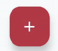

---

### 2. ➕ Add Gift Screen (`GiftDetailScreen`)

Create a Gift detail screen to add or edit a gift.

- Navigate to Add Gift Screen
    - If we click on the FAB, we pass null (new gift)
    - If we click on an existing gift, we pass the gift ID
- Create a reusable TextField composable with:
    - Label
    - Initial Value
    - onValueChange
    - Category
    - Optional TrailingIcon
    - Keyboard Options & Actions
      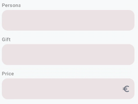
- Add field below the text fields to show if the gift is purchased or not.
  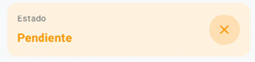
- Create the form with a TopAppBar with and a back button or close button depending if the user is
  editing
  
- Add a save/edit button to change mode.
  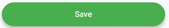

---

### 3. 🔍 Summary Screen (`SummaryScreen`)

Display main info about the total of the gifts

- Create an item which contains an icon, text and @Composable content. We should be able to reuse it
  and pass the surface and icon color.
  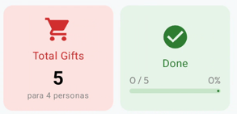
- Create a grid layout with an odd number of items:
    - When we have only one item in a row, it should take the full width.
    - The maximum number of columns is 2 when compact and 3 when expanded.
      -Recommended Items:
    - Total Gifts
    - Total Expense
    - Most expensive gift
    - Least expensive gift
      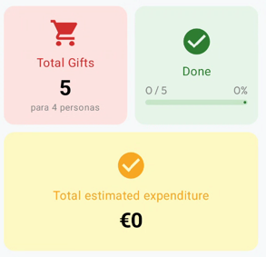

---

#### 3.1 ✏️ Circular chart

- Create a circular chart to show the total expense and the expense per person.
- Reuse the Add Gift form
- Pre-fill existing data
- Save changes
  TODO add documentation about how to create a circular chart in compose.

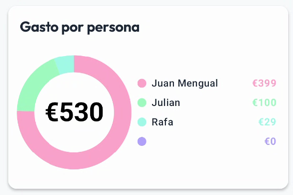
---

#### 3.2. Next Steps

- Create a NextSteps section which shows the remaining gifts to buy.
- Be able to mark the gift as purchased from this section.
- Show confirmation snackbar when marking as purchased. (TODO)

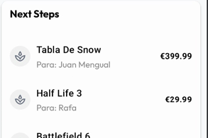

---

## 💫 UI Animations

For this part of the kata we will focus on adding animations to improve the user experience.
All the animations are done with the Compose animation APIs. For more information and help, check
the link:

- https://developer.android.com/develop/ui/compose/animation/choose-api

---

### 1. 🎞️ Gift Item Animations

Let’s add some animations to the gift item in the list. I want you to make an animation when the
user, checks
the gift as purchased. The item should be animated as if it is being wrapped as a gift.

Here an example of how it could look like:

[GiftItem_video.mp4](docs/video/GiftItem_video.mp4)

---

### 2. FAB Animation

Now, we only want the FAB to appear when the user is in the Gift List screen. So, let's animate the
visibility of the FAB,
when the user is not there and navigate to the SummaryScreen.

[FAB_video.mp4](docs/video/FAB_video.mp4)

### 3. Save/Edit Button Animation

When the user is adding or editing a gift, we want to animate the Save/Edit button to give feedback
to the user. So when changing state
from editing to save we want the button to be small and big, but also we want to change the color of
the button.

But when the state is changing from save to editing we want the button to do the same but show a
little loading.

📌 *Screenshot placeholder:*  
`<!--  -->`

### 4. Screen Transition Animations

When navigating between screens, we want to add some transition animations to improve the user
experience. For example, when navigating from the Gift List to the Gift Detail screen. Let's see how
is this done in Navigation 3.

[Transition_video.mp4](docs/video/Transition_video.mp4)

### 5 . List/Details View Animation

When the user selects a gift from the list to view its details, we want to animate the transition
between the list item and the detail view. This will create a smooth and engaging experience for the

When the user selects a gift from the list ot view its details, and the screen is wide enough to
show both the list and the details side by side, we want to show both views at the same time in two
different panes.

### 6. List Appearance Animation

When the gift list appears on the screen, we want to animate the items in the list to create a more
engaging experience.

### 7.Swipe to delete with animation

When the user swipes a gift item to the right, we want to animate the item showing is gonna be
deleted.
https://developer.android.com/develop/ui/compose/touch-input/pointer-input/drag-swipe-fling#swiping

[swipeToDelete_video.mp4](docs/video/swipeToDelete_video.mp4)

### EXTRA POINTS: 🤓

It is said that the most brave developers don not stop here. They go further for more animations. If
you are a brave developer, you can try to add a new animation for the chart in the summary screen.
For example, you can animate the chart when the data changes, or when the user navigates to the
summary screen

## Create categories.

---

